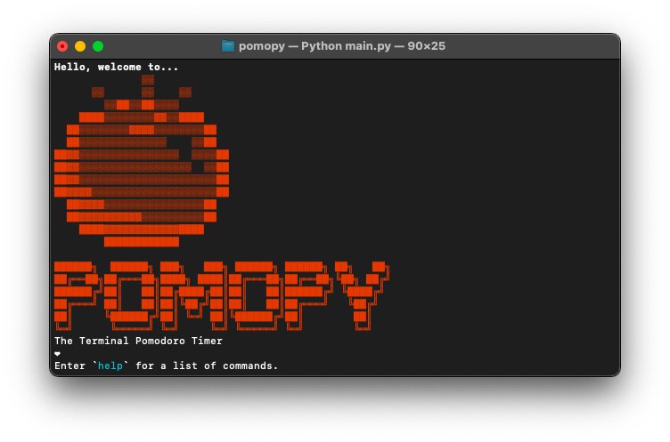

# Pomopy (pom-oh-pie): An old-school solution for a modern problem



## 🍅 What is Pomopy?
Pomopy is a fun ASCII-art-filled, customizable time-management solution to optimize productivity. The Pomodoro Technique was developed by Francesco Cirillo in the 1980s and emphasizes working and taking breaks in regular intervals. 

## Installiation
```bash
git clone https://github.com/sophiezhng/pomopy.git
```
### Install packages 
```bash 
cd pomopy
pip install -r requirements.txt
chmod +x pomopy.py
```

## Usage
```bash
./pomopy.py
```

## 🌱 How it's built
This Pomodoro timer was built in Python using the playsound library to play an alarm effect after each interval. It saves your preferences in a JSON file locally so that you can start and stop easily. Use the `help` command to see all of available commands.

## Available Commands:
Make sure your volume is unmuted to hear when the timer goes off!

### Basic Commands:
`start` - Begin the timer from start of work period

`stop` - End Pomodoro timer

`remaining` - Remaining time left until next interval

`pause` - Pause the timer temporarily until resume

`resume` - Continue from where you left off

`clear` - Clear the terminal

`quit` - Quit the program

### Customize Settings:
`set work [number of mins]` - Change length of work period

`set break [number of mins]` - Change length of break period

`auto off` - Manually switch between working and breaks

➪ if enabled, must use `start work` or `start break`

`auto on` - Default setting: automatically switchs between work and break periods in succession

### More Info:

`about` - Purpose of the program, author, credits, and more

### Fun Features:

`tomato` - Recieve a mysterious tomato

`hack` and `hack save` - Trick your friends into thinking you are a hacker by saving a custom message in advance and entering `hack` when you are ready.

## 🍝 What's next for Pomopy 
Future goals, subject to change include:
1. Adding Desktop Notifications
2. Two Modes: Live Updated Timer and a Hidden Timer
3. Simplify code to be shorter and more concise
