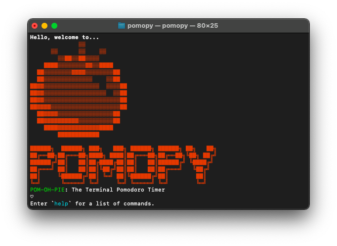

# Pomopy (pom-oh-pie): An old-school solution for a modern problem



## 🍅 What is Pomopy?
Pomopy is a fun ASCII-art-filled, customizable time-management solution to optimize productivity. The Pomodoro Technique was developed by Francesco Cirillo in the 1980s and emphasizes working and taking breaks in regular intervals. 

## Installation
```bash
git clone https://github.com/sophiezhng/pomopy
cd pomopy
pip install -r requirements.txt
python setup.py install
```

## Usage
```bash
pomopy
```

Make sure your volume is unmuted to hear when the timer goes off!

## 🌱 How it's built
This Pomodoro timer was built in Python using the playsound library to play an alarm effect after each interval. It saves your preferences in a JSON file locally so that you can start and stop easily. Use the `help` command to see all of available commands.

Read Wiki For More Info => [Full List of Commands](https://github.com/sophiezhng/pomopy/wiki/Commands)

## 🍝 What's next for Pomopy 
Future goals, subject to change include:
1. Adding Desktop Notifications
2. Package for more convenient installation
3. Simplify code to be shorter and more concise
